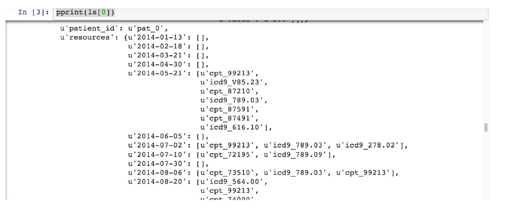
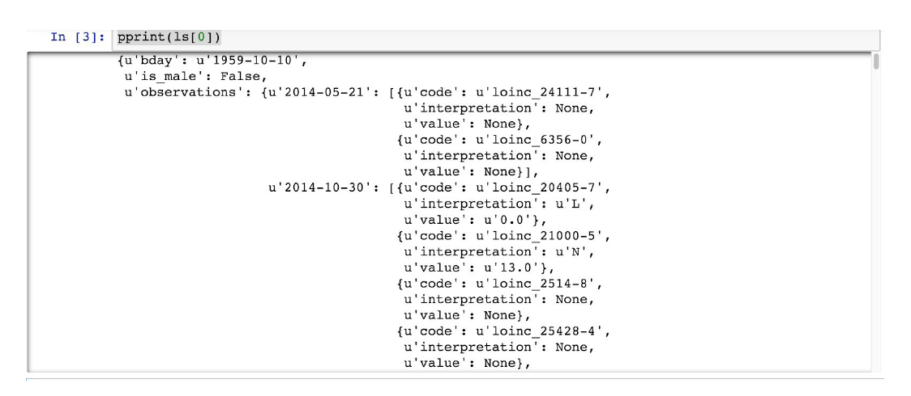
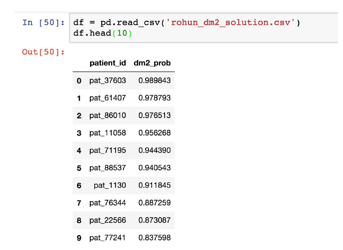
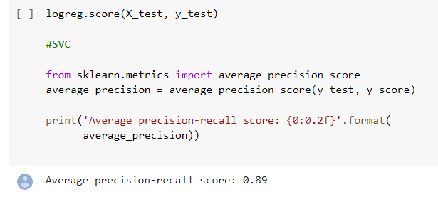
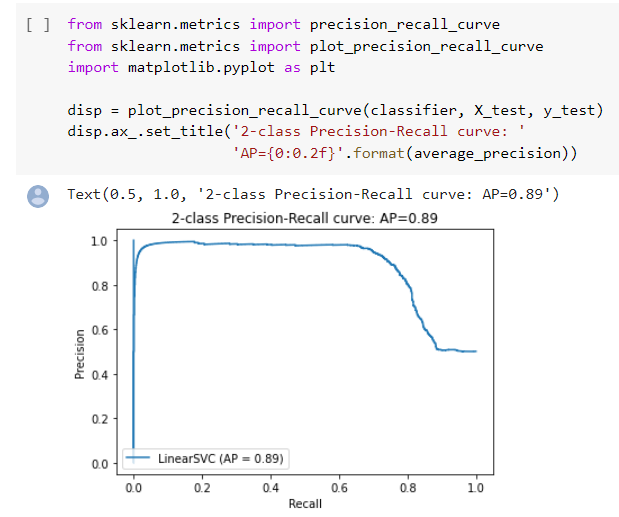

# Prediction-of-Patient-Diabetes-using-Insurance-Claims-Dataset

# Amazon-Product-Recommendation-System

### Table of contents
* [Introduction](#introduction)
* [Problem Statement](#problem-statement)
* [Data Source](#data-source)
* [Technologies](#technologies)
* [Type of Data](#type-of-data)
* [Data Pre-processing](#data-pre-processing)
* [Algorithms Implemented](#algorithms-implemented)
* [Steps Involved](#steps-involved)
* [Evaluation Metrics](#evaluation-metrics)
* [Results and Conclusion](#results-and-conclusion)

### Introduction
Diabetes is a highly prevalent and expensive chronic condition, costing about $330 billion to Americans annually. Most of the cost is attributed to the ‘type-2’ version of diabetes, which is typically diagnosed in middle age.

Today is December 31, 2016,  a commercial health insurance company has contracted you to predict which of their members are most likely to be newly-diagnosed with type-2 diabetes in 2017. Your goal is to featurize their data, train and optimize a predictive model, and explain your results and approach. (Note: “newly-diagnosed” means members who were NOT previously coded with diabetes prior to 2016-12-31, inclusive).

### Problem Statement
* Your goal is to featurize the INsurance claims data, and train and optimize a predictive model to find the risk of diabetes in patients.

### Data Source
* The Dataset was provided by Lumiata company which deals with Healthcare insurance claims

### Technologies
* Python 3.6.7

### Type of Data
* The data provided are real patient claims records from a large insurance company, appropriately de-identified. The data sets have already been split into training and test sets (‘train.txt’ & ‘test.txt’).
* Train : 70%
* Test  : 30%

Each line in both text files is a patient record, represented as a json string. The health record is
parameterized by a set of encounter dates in a YYYY-MM-DD format. The structure of each
patient json is as follows:
- ‘bday’ - patient date of birth in YYYY-MM-DD format
- ‘is_male’ - True = Male, False = Female
- ‘patient_id’ - de-identified patient id (each patient is given a unique value)
- ‘resources’ - dictionary of encounter_date → list of codes (described below)
- ‘observations’ - dictionary of encounter_date → list of dictionaries (described below)
- ‘tag_dm2’ - indicates date of first type-2 diabetes diagnosis - will either have a
YYYY-MM-DD date or be an empty ‘’ string; this information will be censored from the
holdout set. (described above)
- ‘split’ - indicates a member is in the ‘train’ or ‘test’ set; information beyond 2017-01-01
has been removed from test.txt .
Each patient record has a key ‘tag_dm2’, whose value is either a ‘YYYY-MM-DD’ date string
indicating the date of first code of a diagnosis of diabetes, or an empty string ‘’ (indicating no
diabetes in their record).

You should cohort your data (i.e construct the response variable) in the training set according to
the following definitions (check your work with the training set counts given below for each
definition):

- A ‘ claim ’ is someone whose ‘tag_dm2’ date is between 2017-01-01 and 2017-12-31,
inclusive (training set count of ‘claim’ = 3410) - the response for these members is a ‘1’
- A ‘ never-claim ’ is someone whose ‘tag_dm2’ date is either after 2017-12-31, exclusive,
or is an empty string ‘’ (training set count of ‘never-claim’ = 70110) - the response for
these members is a ‘0’
- A ‘ prior ’ is someone whose ‘tag_dm2’ date is before 2017-01-01, exclusive - typically
‘priors’ are filtered out of the matrix before training. You may include these people in
training, but keep in mind they will be filtered out of ‘test’ when we evaluate your solution.
Each patient record also has two keys describing their health history - ‘resources’ &
‘observations’.
The ‘resources’ key specifies the diagnoses, medications, and procedures that were
noted/prescribed/performed at each doctor’s visit - these are represented by different coding
systems (icd9/10, rxnorm, cpt, respectively.) Each encounter date in the ‘resources’ key is
mapped to the corresponding list of codes issued at that doctor’s visit.

The codes have the format <system>_<code>. For instance, ‘icd9_272.0’, which corresponds to
high cholesterol:
http://www.icd9data.com/2015/Volume1/240-279/270-279/272/272.0.htm
Note - encounter dates in ‘resources’ can sometimes have no codes in the code list!
The ‘observations’ key specifies the lab tests that were completed - each encounter date is
mapped to a list of dictionaries, each of which has the following keys:
- ‘code’ - the ‘loinc’ code corresponding to the lab test
- ‘interpretation’ - whether the lab was ‘H’ for high, ‘L’ for low, ‘N’ for normal, or ‘A’ for
abnormal
- ‘value’ - the value extracted from the lab

For instance, the lab could have been a blood glucose test ‘loinc_2345-7’, whose value may
have been 130, and hence whose interpretation would be ‘H’ (a cut-off for high blood glucose is
106:
https://s.details.loinc.org/LOINC/2345-7.html?sections=Comprehensive )
Note - the values in the ‘interpretation’ and ‘value’ keys can sometimes be ‘None’!
The keys in the ‘resources’ and ‘observation’ dictionary correspond to the encounter date with
the doctor. All dates are formatted as string in YYYY-MM-DD format, e.g. “2016-04-30”.
The format of the file you submit to us should be a csv file, formatted as
‘<your_name_here>_dm2_solution.csv’. We should be able to read in your solution using
pandas as follows:

  
### Data Pre-processing
* Stratified Sampling to obtain a balanced dataset
* Converting the complicated JSON file to a dataframe

### Algorithms Implemented
* Logistic Regression
* Support Vector Classifier (SVC)

### Steps Involved

STEP 1 : Since it was a highly unbalanced data, balancing the dataset using Stratified Sampling technique. I have taken the demographic age variable while using this technique
STEP 2 : Analyzed the ICD9 codes, cpt codes and resource codes and found out which variables contribute to chronic diabetes.
STEP 3 : Removed some of the variables based on the number of unique values and created final dataframe from the complex JSON file.
STEP 4 : Ran statistical tests to find the significant variables in the final dataframe.
STEP 5 : After finding the most significant variables, ran SVC on the final variables and calculated the porbability of diabetes in each patient.
  
### Evaluation Metrics  
RMSE (Root Mean Square Error) 

### Results and Conclusion
By analyzing our dataset, we tried to find the probability of diabetes in each patient by considering their past medical tests and conditions.

The results of the Support Vector Classifier (SVC) are shown below - 

